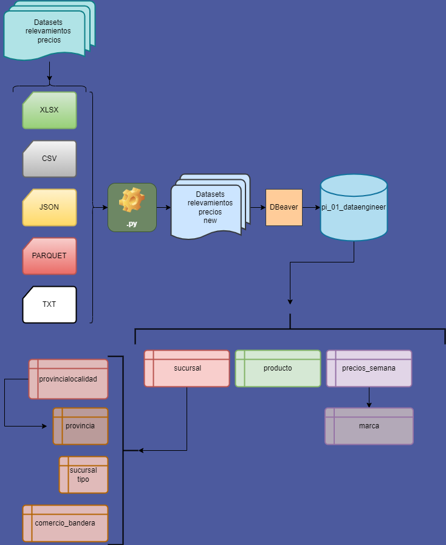

## Readm.me
Welcome to the personal proyect 01 - Data Engineering 1.0, here I'll try and clean/fix/standarize as much as possible the files in './Datasets relevamiento precios' so we can make sense of them, to then apply these new standarized datasets into a MySql Database. 

## To make this possible I used these tools used:

-Pandas

-SQLAlchemy

-DBeaver

## Flow chart: 

## 1) Take datasets from 'Datasets relevamiento precios' and transform them with their respective .py files:
Run Clean_sucursal.py, Clean_producto.py and Clean_precios_semana.py

this will fill up the folder 'Datasets relevamiento precios new' with all the .csv files needed to fill up my database

## 2) Take all the csv files and insert them into DBeaver: 
- Change all VAR(50) into VAR(128) because some strings are way too long  
- run the script 'key_sorting.sql' to generate primary/foreign keys in DBeaver with the database selected

## 3) To finish up, run incremental_load.py to load the last dataset into the database to make sure incremental load is possible

And that's it!

